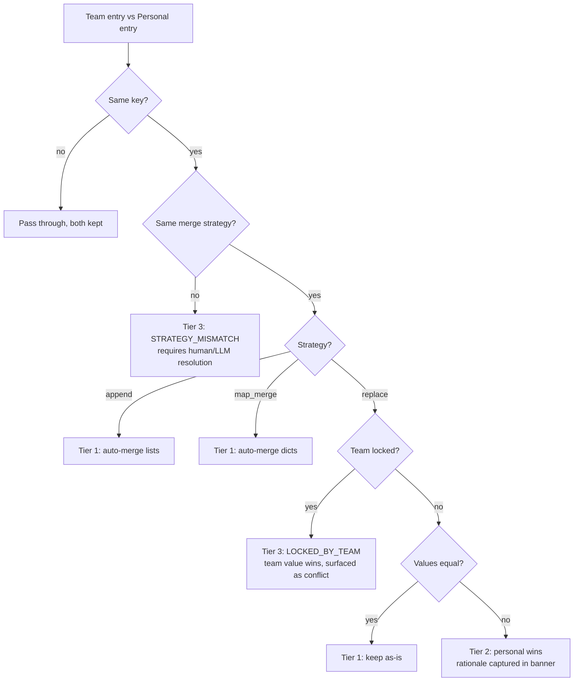
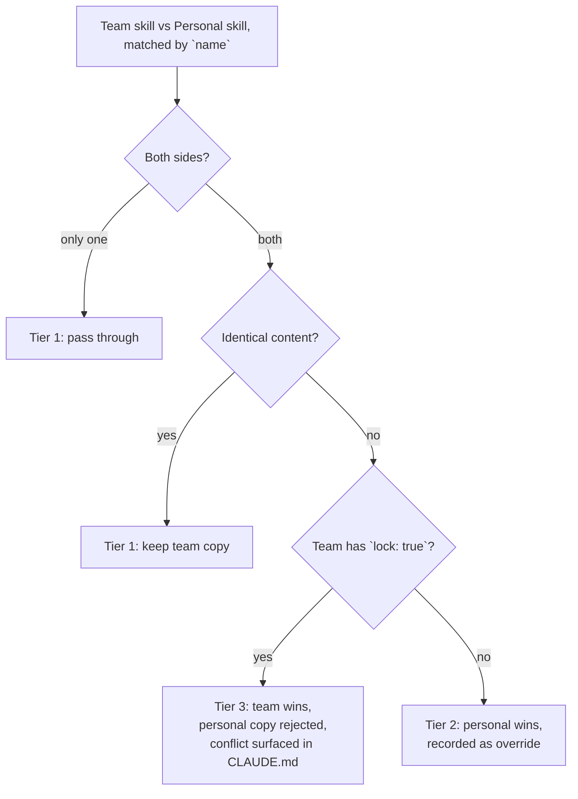

# sharing-is-caring (`sic`)

> A shared **memory profile** for AI coding assistants. One team brain, many
> developers — your team agrees on conventions, glossaries, and forbidden
> patterns once, and every teammate's Claude / Copilot / Cursor session
> applies them automatically.

Inspired by the workflow described in MatMaq's *"I Built a Shared Memory
Profile for My Data Team — Claude Treats Us Like One Brain Now"*.

`sic` reduces a team YAML profile + a personal YAML profile into a single
`CLAUDE.md` (or `~/.claude/CLAUDE.md`) that AI assistants pick up on their
own. Personal preferences extend team rules; team locks prevent personal
overrides where consistency matters; tiered conflict resolution handles the
rest.

---

## Quickstart

```bash
pip install sharing-is-caring   # or: pip install -e .[dev]

# 1. Bootstrap a workspace pointing at your team profile repo
sic init --team-repo git@github.com:acme/data-team-profile.git --owner alice

# 2. Edit your personal profile
$EDITOR ~/.sic/personal.yaml

# 3. Pull team updates + render CLAUDE.md into the current project
sic sync --render project
```

That's it. `CLAUDE.md` in the repo root is regenerated; commit it (or
gitignore it — your call).

### Optional: seed your personal profile from a ChatGPT export

```bash
sic import-chatgpt ~/Downloads/chatgpt-memories.json --as alice \
     -o ~/.sic/personal.yaml
```

---

## CLI reference

| Command | Purpose | Exit codes |
| --- | --- | --- |
| `sic init --team-repo URL --owner NAME` | Clone team repo + scaffold `~/.sic/personal.yaml` | 0 / 1 |
| `sic sync [--render user\|project]` | `git pull` team repo, re-merge, optionally re-render | 0 / 1 / 3 |
| `sic validate PATHS... [--strict]` | Validate one or more profile YAMLs | 0 / 1 |
| `sic merge TEAM PERSONAL [-o OUT]` | Print/write the merged profile YAML | 0 / 3 |
| `sic render TEAM PERSONAL [--target user\|project\|-]` | Render `CLAUDE.md` | 0 / 3 |
| `sic conflicts TEAM PERSONAL` | Show unresolved conflicts as a table | 0 / 3 |
| `sic diff A B` | Show entries that differ between two profiles | 0 |
| `sic import-chatgpt EXPORT --as OWNER [--use-llm]` | Convert a ChatGPT memory export to a personal profile | 0 / 1 |
| `sic skills list \| show \| validate \| new \| install \| diff` | Manage shared team skill bundles (see [Sharing skills](#sharing-skills)) | 0 / 1 / 3 |

Exit code legend: `0` success · `1` hard error · `3` unresolved conflicts.

`~/.sic/` (override with `$SIC_HOME`) contains:

```
~/.sic/
├── config.json          # team repo URL + path to team profile + skill_targets
├── team/                # git clone of the team profile repo
│   ├── team.yaml
│   └── skills/          # team skill bundles (cdp-mcp/, sql-style/, …)
├── personal.yaml        # your personal profile overlay
└── personal-skills/     # your personal skill bundles
```

---

## Profile schema

Both team and personal profiles share one schema (`schema_version: 1`):

```yaml
schema_version: 1
profile:
  scope: team                  # team | personal
  owner: acme-data-platform    # repo/team name or your handle
  updated_at: '2026-06-03'
entries:
  - section: tools
    key: dataframe_library
    value: polars
    merge: replace
    priority: 80
    lock: true                 # team-only; forbidden on personal profiles
    rationale: standardize stack
```

### Sections

| Section | Examples |
| --- | --- |
| `identity` | name, team, role, editor |
| `languages` | primary/secondary languages |
| `tools` | IDE, dataframe lib, DB, orchestrator |
| `coding_style` | indent, type hints, docstrings, naming |
| `workflow` | git flow, PR checklist, review etiquette |
| `domain_knowledge` | glossary, metric definitions |
| `do_not` | forbidden patterns, anti-goals |
| `free_form` | anything else |

### Merge strategies (per entry)

| `merge:` | Value type | Behavior |
| --- | --- | --- |
| `replace` | scalar / any | Personal wins unless team has `lock: true` |
| `append` | list | Dedup-preserving concat of team + personal |
| `map_merge` | dict | Shallow merge; personal keys win |

`priority` (0–100) is reserved for future LLM-mediated tie-breaks; today it
shows up in conflict tables to help reviewers decide.

---

## Conflict resolution (the three tiers)



Unresolved conflicts (Tier 3) make `sic merge`, `sic render`, and
`sic sync` exit with status `3`. They are also written into the rendered
`CLAUDE.md` under an **⚠️ Unresolved conflicts** section so the agent can
warn you mid-session.

Inspect them at any time:

```bash
sic conflicts ~/.sic/team/team.yaml ~/.sic/personal.yaml
```

---

## Sharing skills

Profiles capture *preferences* — concise key-value facts about how your team
likes to work. **Skills** capture *playbooks* — multi-paragraph instructions an
agent should load on demand when it touches a specific tool or task (e.g.
"driving the CDP MCP", "writing dbt models in our style", "calling the
internal feature store").

A skill is a directory inside the team repo's `skills/` folder:

```
skills/
  cdp-mcp/
    SKILL.md          # required — frontmatter + body
    examples/         # optional supporting files
```

`SKILL.md` has YAML frontmatter the agent uses for routing:

```yaml
---
name: cdp-mcp
version: 0.3.0
description: >
  How to drive Acquia CDP MCP — campaign+audience+email is one POST+PUT,
  body params are JSON strings, _EQUALS not _OR_EQUAL.
applies_to: [cdp, acquia, campaignDefs]
owner: data-platform
tags: [mcp, acquia]
lock: false            # team-only; if true, personal copies are rejected
---
# body — anything the agent should know
```

### Workflow

```bash
# 1. Enable skill installation in your local sic config.
#    Edit ~/.sic/config.json and add: "skill_targets": ["claude"]
#    (built-ins: claude, copilot, generic)

# 2. Scaffold a personal skill on top of the team's.
sic skills new my-helper

# 3. Pull team skill updates AND install everything to the agent layout.
sic sync                            # installs to all configured targets
sic skills install --target claude  # one-shot, explicit target

# 4. Inspect.
sic skills list                # table with version, scope, lock flag
sic skills show cdp-mcp        # print the rendered SKILL.md
sic skills diff                # show team vs personal differences
sic skills validate            # lint every workspace skill
```

### Install layouts

`sic skills install` (also invoked by `sic sync`) writes to whichever
targets are listed in `config.skill_targets`:

| Target | Writes to | Shape |
| --- | --- | --- |
| `claude` | `~/.claude/skills/<name>/SKILL.md` (+ assets) | one directory per skill |
| `copilot` | `<project>/.github/prompts/<name>.skill.md` | single file per skill |
| `generic` | `<project>/.ai/skills/<name>/` (+ assets) | one directory per skill |

Each target maintains its own `.sic-manifest.json` tracking the files it
owns, so re-installing after removing a skill **only** deletes that
skill's files — hand-written `SKILL.md` files alongside are never touched.
File writes are byte-diff idempotent.

### Conflict resolution (same three tiers as profiles)



Tier-3 skill conflicts make `sic sync` and `sic skills install` exit
`3` (same as profile conflicts) and are listed under "⚠️ Unresolved
skill conflicts" in the rendered `CLAUDE.md`.

### What the agent sees in `CLAUDE.md`

When skills are installed, `sic render` / `sic sync --render` appends a
table so the agent (and your reviewers) know which bundles exist:

```markdown
## Available skills

| Name | Version | Scope | Description |
| --- | --- | --- | --- |
| `cdp-mcp` | 0.3.0 | team | How to drive Acquia CDP MCP — … |
| `sql-style` 🔒 | 1.0.0 | team | Team SQL formatting conventions … |
| `my-helper` | 0.1.0 | personal | Personal helper script for … |
```

---

## Setting up a team profile repo

A team profile repo is just a git repo containing a `team.yaml` (path is
configurable via `--team-profile-path`). Add CI to keep it valid:

```yaml
# .github/workflows/validate.yml — already shipped in templates/team-repo/
name: validate
on: [push, pull_request]
jobs:
  validate:
    runs-on: ubuntu-latest
    steps:
      - uses: actions/checkout@v4
      - uses: actions/setup-python@v5
        with: { python-version: '3.11' }
      - run: pip install sharing-is-caring
      - run: sic validate --strict $(find . -name '*.yaml' -not -path './.git/*')
```

See `examples/team.yaml` for a realistic starting point and
`examples/{alice,bob}.personal.yaml` for matching personal profiles
(including a deliberate Tier-3 conflict between Bob and the team).

---

## Determinism & provenance

Every rendered `CLAUDE.md` starts with a banner like:

```
<!--
  Generated by sic v0.1.0. DO NOT EDIT — edit the source profile YAML instead.
  team    : acme-data-platform
  personal: alice
  content : sha256:9c0fda3b1e22
  at      : 2026-06-03T14:21:08Z
-->
```

Use `--no-timestamp` for byte-stable output (the project pins golden files
in `tests/golden/`). The `content:` SHA covers the resolved profile, so two
teammates running the same `team@SHA` and the same personal file get the
same hash.

---

## Development

```bash
pip install -e '.[dev]'   # add ',llm' for the optional Anthropic SDK
pytest -q                 # 181 tests across profiles + skills
```

Project layout:

```
src/sic/
  schema.py     # pydantic v2 models, JSON Schema export
  loader.py     # ruamel.yaml round-trip I/O
  merger.py     # tiered merge + conflict surfacing
  renderer.py   # CLAUDE.md emitter (skill-aware)
  workspace.py  # ~/.sic/ + git operations + config
  importer.py   # ChatGPT export → personal profile
  skills/       # SKILL.md schema, loader, resolver, installer, CLI subgroup
  cli.py        # typer entrypoint
tests/          # unit + golden + integration
examples/       # team.yaml + personal fixtures + chatgpt export + skills/
templates/      # team repo CI scaffold
PLAN.md         # full design doc
```

---

## Why not just an MCP server?

A `CLAUDE.md` file is the lowest-common-denominator integration: Claude
Code, Copilot Chat, Cursor, Aider, Continue and most other agents either
read it natively or can be pointed at it with one config line. An MCP
server is a planned add-on (`sic serve`) for richer interactions — letting
the agent query individual rules, propose new entries, or push a personal
update back into git — but is not required to get value today.
